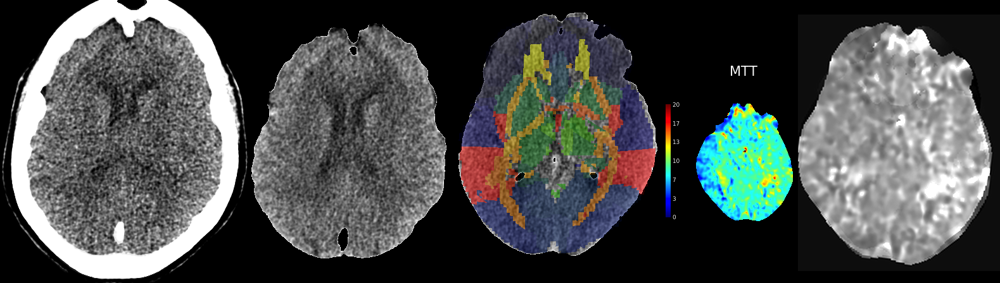

# CTPerfusionPipeline

This code replicates the CT perfusion preprocessing pipeline from Teghipco, A., Kim, H., Rorden, C., Newman-Norlund, R., Sharif M., Sikorski D., Hillis, A.E. (in preperation). Excellence is a habit: Enhancing predictions of language impairment by identifying stable features in clinical perfusion scans. 

## Usage

Input images should be NIfTI (.nii or .nii.gz in which case they will be automatically uncompressed). These can be created from DICOM using [dcm2niix](https://github.com/rordenlab/dcm2niix).

It's assumed that you are working with perfusion measure images output by RAPID and CTA head/neck images. Please see documentation in ct_rgb.m for the script that does the majority of the work. Additionally, see runPipeline.m for more information on setting up the pipeline (including example calls).

## Requirements

* MATLAB (for running the pipeline)
* SPM12 (for co-registration, normalization)
* FSL (for bet)
* NiiStat and some matlab code from freesurfer is optional for organizing atlas-based perfusion measures (needed for MatFilesFromNativeSpaceImageAndAtlas.m)

## Summary

See documentation for full pipeline details. The convert_ctp.m script will convert perfusion images to NFITI. The two sets of images will be co-registered, then normalized. Using the resulting transforms, an atlas (e.g., JHU atlas) will be brought into native space. You can then use scalar_atlas.m and MatFilesFromNativeSpaceImageAndAtlas.m to extract perfusion measures within each ROI of the atlas and generate raw or global mean scaled and global scaled images that are organized within a .mat structure.

## Methods overview

The rapid CT sequence acquired 44 volumes each with 512x512x49 voxels and a resolution of 0.4x0.4x3.0mm, which we refer to as the structural scan. Based on this raw data, RAPID proprietary software generated maps for mean-time-to-transit (MTT), cerebral blood flow (CBF) and crebral blood flow (CBV) each with 256x286x15 voxels with a resolution of 0.8x0.8x10mm. These derived images are stored in a proprietary red-green-blue (RGB) color scheme.

SPM12's realignment function was used to create a mean image of the structural scan, improving the signal-to-noise. FSL's Brain Extraction Tool (BET) scalp stripped the mean structural scan using the method described by Muschelli et al., [2015](https://pubmed.ncbi.nlm.nih.gov/25862260/). The image origin was set to the center of brightness (with CT scans DICOMs use the table center as the origin which provides a poor starting estimate for the anterior commissure). SPM12's normalization routines were used to calculate the deformation required to transform the CT template from the [Clinical Toolbox](https://github.com/neurolabusc/Clinical) (Rorden et al., [2012](https://pubmed.ncbi.nlm.nih.gov/22440645/)) to the native space of the structural scan. This spatial transformation was applied to the atlas maps, using nearest neighbor interpolation to preserve discrete regions. The derived RGB images were converted to scalar maps using a [custom script](https://github.com/neurolabusc/rgb2scalar) and the origin was set to the center of brightness. SPM12's coregistration methods were used to warp these images to match the structural scan. At this stage, both the atlases and the derived images were in the same space. The mean intensity for each atlas parcel was calculated. 

## Parting tips

This version of ctp_rgb.m can independently run portions of the pipeline. This is helpful because coregistration and/or normalization may fail for some individuals. It's important to manually inspect all outputs. In my experience, this usually occurs because of poor brain extraction. See ctp_rgb.m for more information on how to run the pre-BET pipeline so that you can manually attempt different bet options to improve extraction (see runPipeline.m for effective strategies for improving extraction). You can then run ctp_rgb.m again using the post-bet pipeline. Even with good brain extraction, it is possible for normalization to be poor when signal is lower. This can be remedied by increasing the smoothing parameters for the reference image *only* by 2mm. In some participants, smoothing may need to be increased to 6mm to achieve serviceable results (see optional arguments for ctp_rgb.m)
